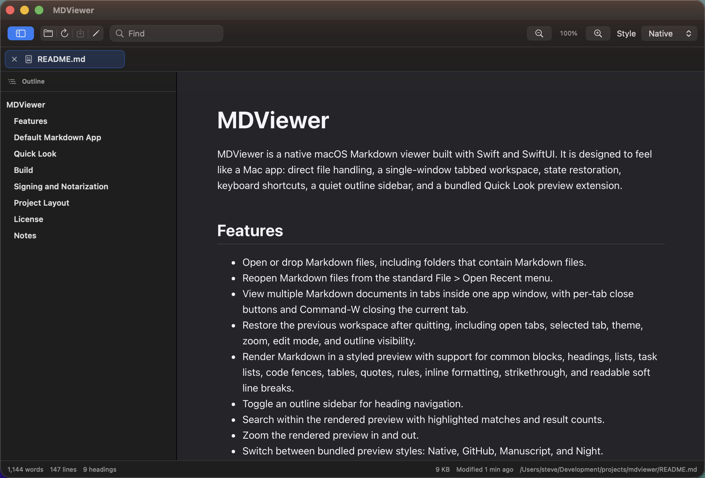

# MDViewer

MDViewer is a native macOS Markdown viewer built with Swift and SwiftUI. It is designed to feel like a Mac app: direct file handling, a single-window tabbed workspace, state restoration, keyboard shortcuts, a quiet outline sidebar, and a bundled Quick Look preview extension.



## Features

- Open or drop Markdown files, including folders that contain Markdown files.
- Reopen Markdown files from the standard File > Open Recent menu.
- View multiple Markdown documents in tabs inside one app window.
- Restore the previous workspace after quitting, including open tabs, selected tab, theme, zoom, edit mode, and outline visibility.
- Render Markdown in a native SwiftUI preview with support for common blocks, headings, lists, code fences, tables, quotes, rules, and inline formatting.
- Toggle an outline sidebar for heading navigation.
- Search within the rendered preview with highlighted matches and result counts.
- Zoom the rendered preview in and out.
- Switch between bundled preview styles: Native, GitHub, Manuscript, and Night.
- Edit Markdown beside the rendered preview and save changed files.
- Reload from disk, reveal files in Finder, copy file paths, and copy rendered HTML.
- Use toolbar controls with hover help and accessibility labels.
- Preview Markdown in Finder via the bundled `MDViewerQuickLook.appex` Quick Look extension.

MDViewer supports `.md`, `.markdown`, `.mdown`, and `.mkd` files and declares the `net.daringfireball.markdown` document type.

## Quick Look

The app embeds a native Quick Look Preview extension at:

```text
MDViewer.app/Contents/PlugIns/MDViewerQuickLook.appex
```

The extension uses Apple’s modern `QLPreviewProvider` / `QLPreviewingController` preview-extension path and returns a styled HTML preview for Markdown files. It reuses the app’s Markdown renderer and bundled Native stylesheet.

When testing a freshly built copy, macOS may need the app bundle to be registered before Finder offers the extension. Building with Xcode registers the app through Launch Services; if Finder still uses a cached preview, reset Quick Look with:

```sh
qlmanage -r
qlmanage -r cache
```

For downloaded builds, move `MDViewer.app` to `/Applications` or `~/Applications` and launch it once so macOS can register the embedded extension. If previews stop appearing, confirm `MDViewer Quick Look` is enabled in System Settings under Extensions, then re-register the installed extension and reset Quick Look:

```sh
pluginkit -r /Applications/MDViewer.app/Contents/PlugIns/MDViewerQuickLook.appex
pluginkit -a /Applications/MDViewer.app/Contents/PlugIns/MDViewerQuickLook.appex
pluginkit -e use -i com.meyfroidt.mdviewer.quicklook
qlmanage -r
qlmanage -r cache
```

If Finder shows a warning such as “Apple could not verify `<file>.md` is free of malware,” macOS is blocking the Markdown document itself, not the MDViewer bundle. That can happen when the file has a quarantine extended attribute. MDViewer removes its own quarantine marker after successfully opening, restoring, reloading, or saving a Markdown file, but existing files that already carry quarantine metadata may need a one-time cleanup:

```sh
xattr -d com.apple.quarantine path/to/file.md
```

## Build

Open `MDViewer.xcodeproj` in Xcode and run the `MDViewer` scheme.

Command-line debug build:

```sh
xcodebuild -project MDViewer.xcodeproj -scheme MDViewer -configuration Debug -derivedDataPath build/DerivedData build
```

Command-line release build:

```sh
xcodebuild -project MDViewer.xcodeproj -scheme MDViewer -configuration Release -derivedDataPath build/DerivedData build
```

GitHub Actions also runs a Release build on every push to `main` or `master` and uploads a zipped `MDViewer.app` workflow artifact. Pushing a version tag such as `v0.1.10` also creates a GitHub Release with `MDViewer.app.zip` attached.

The release app is produced at:

```text
build/DerivedData/Build/Products/Release/MDViewer.app
```

## Signing and Notarization

MDViewer uses Apple Team ID `EZCN55TA7J`, app bundle ID `com.meyfroidt.mdviewer`, Quick Look bundle ID `com.meyfroidt.mdviewer.quicklook`, and Developer ID signing for Release builds. The main app is hardened and notarized for direct Developer ID distribution; the bundled Quick Look extension remains sandboxed as required for extensions. Branch builds in GitHub Actions remain ad-hoc signed for CI, while `v*` tags build with Developer ID signing, submit the app to Apple notarization, staple the ticket, verify the final packaged app, and publish the notarized zip to GitHub Releases.

The release workflow expects these GitHub repository secrets:

- `DEVELOPER_ID_APPLICATION_CERTIFICATE_BASE64`: base64-encoded `.p12` export of the Developer ID Application certificate.
- `DEVELOPER_ID_APPLICATION_CERTIFICATE_PASSWORD`: password used when exporting the `.p12`.
- `APPLE_ID`: Apple ID used for notarization.
- `APPLE_APP_SPECIFIC_PASSWORD`: app-specific password for the Apple ID.

After exporting the Developer ID Application certificate from Keychain Access as a password-protected `.p12`, copy it into the GitHub secret with:

```sh
base64 -i DeveloperIDApplication.p12 | tr -d '\n' | gh secret set DEVELOPER_ID_APPLICATION_CERTIFICATE_BASE64 -R smeyfroi/mdviewer
gh secret set DEVELOPER_ID_APPLICATION_CERTIFICATE_PASSWORD -R smeyfroi/mdviewer
gh secret set APPLE_ID -R smeyfroi/mdviewer
gh secret set APPLE_APP_SPECIFIC_PASSWORD -R smeyfroi/mdviewer
```

Useful checks for a local signed build:

```sh
codesign --verify --deep --strict --verbose=2 build/DerivedData/Build/Products/Release/MDViewer.app
spctl -a -vvv -t exec build/DerivedData/Build/Products/Release/MDViewer.app
xcrun stapler validate build/DerivedData/Build/Products/Release/MDViewer.app
```

## Project Layout

- `MDViewer/ContentView.swift` contains the main SwiftUI app surface and native rendered preview.
- `MDViewer/WorkspaceStore.swift` manages tabs, file access, workspace restoration, themes, zoom, edit state, and file commands.
- `MDViewer/MarkdownRenderer.swift` renders Markdown to HTML for copy/export and Quick Look.
- `MDViewer/Styles/` contains bundled preview styles.
- `QuickLookPreview/` contains the bundled Quick Look Preview extension.
- `Tools/generate_app_icon.py` regenerates the app icon assets.

## License

MIT. See `LICENSE`.

## Notes

The Markdown renderer is intentionally dependency-free for the initial project. It supports common Markdown blocks and inline formatting, and is isolated in `MarkdownRenderer.swift` so it can be replaced later with a CommonMark/GFM parser if the app needs full compatibility.

Stylesheet acknowledgements live in `ACKNOWLEDGEMENTS.md`.
